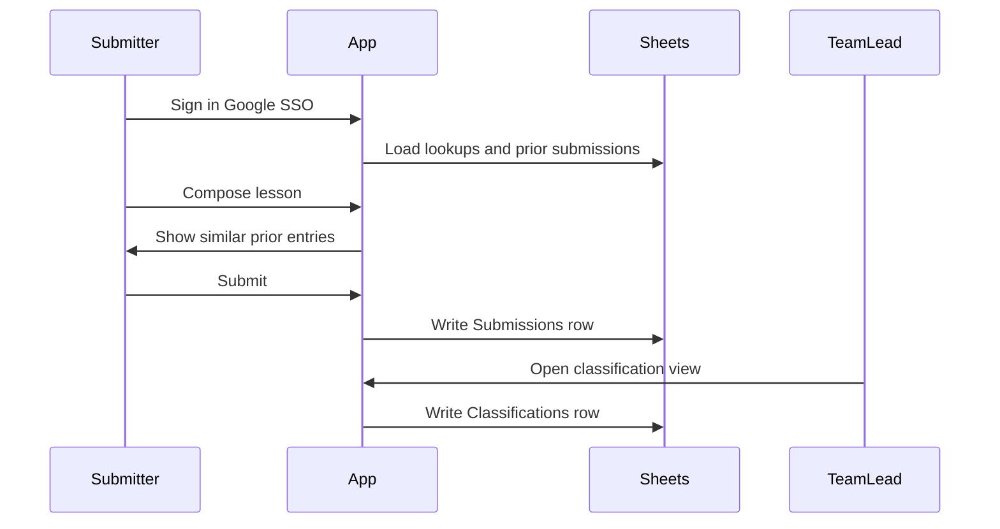

# Submission workflow

Rationale for the two-phase capture model: low-friction submit first, team-lead enrichment second.

BRs: [BR-001](../../../manifest/business-requirements.md), [BR-002](../../../manifest/business-requirements.md), [BR-003](../../../manifest/business-requirements.md), [BR-005](../../../manifest/business-requirements.md). Architecture: [time-capsule.md](../architecture/time-capsule.md).

## Why two phases

Convention staff are busy and may lack deep production experience. Requiring classification or approval before submit would reduce participation. Team leads have the context to organize feedback **after** the raw lesson is captured.

## Active submission mode

1. **Authenticate** — Google SSO; submitter email stored automatically.
2. **Select domain** — One of six knowledge domains; drives lookup suggestions and prior-entry filter.
3. **Compose** — Title (optional), body (required), contact fields per MVP scoping.
4. **Review priors** — Side panel or inline list of related submissions (domain/tag filter for MVP; similarity search later if scoped).
5. **Optional upload** — Attach supporting document (BR-004; may defer post-MVP).
6. **Submit** — Single action; no team-lead gate.

**Friction budget:** Target under five minutes (BR-001). Minimize required fields; mobile-friendly layout per [visual-style.md](../architecture/visual-style.md).

## Prior-submission surfacing

During compose, the app queries existing **Submissions** (and enriched **Classifications** when present) filtered by:

- Selected knowledge domain (MVP minimum)
- Suggested tags from **Lookups** as corpus grows

Purpose: reduce duplicates, inform the writer, and surface institutional memory at the moment of capture (BR-002).

## Team-lead mode

After submit, team leads use an elevated view to:

- Assign tags, severity, area, follow-up status
- Add enrichment notes and cross-links to related submission IDs
- Organize browse/filter views for the archive

Original submitter text is immutable; enrichments live in **Classifications** (BR-003).

Authorization model is open — see [mvp-scoping.md](mvp-scoping.md) and [time-capsule.md](../architecture/time-capsule.md).

## Learning loop

As submissions accumulate:

1. **Lookups** tab gains synonyms and canonical tag mappings (maintainer or team-lead curation).
2. **Patterns** — simple counts or grouped views by domain/tag (MVP); richer trend views later.
3. Submitters see normalized suggestions on new entries (BR-005).

Historical submissions retain original values; classifications and lookup maps provide traceability.

## Maintainer workflow

From the repo (BR-007):

- Inspect Sheet tabs and Drive attachments
- Update lookup seeds, form field config, and UI copy in source
- Redeploy static client when structure changes; lookup-only changes may be Sheet-side without redeploy

## Related

- [mvp-scoping.md](mvp-scoping.md)
- [google-workspace-bootstrap.md](google-workspace-bootstrap.md)
