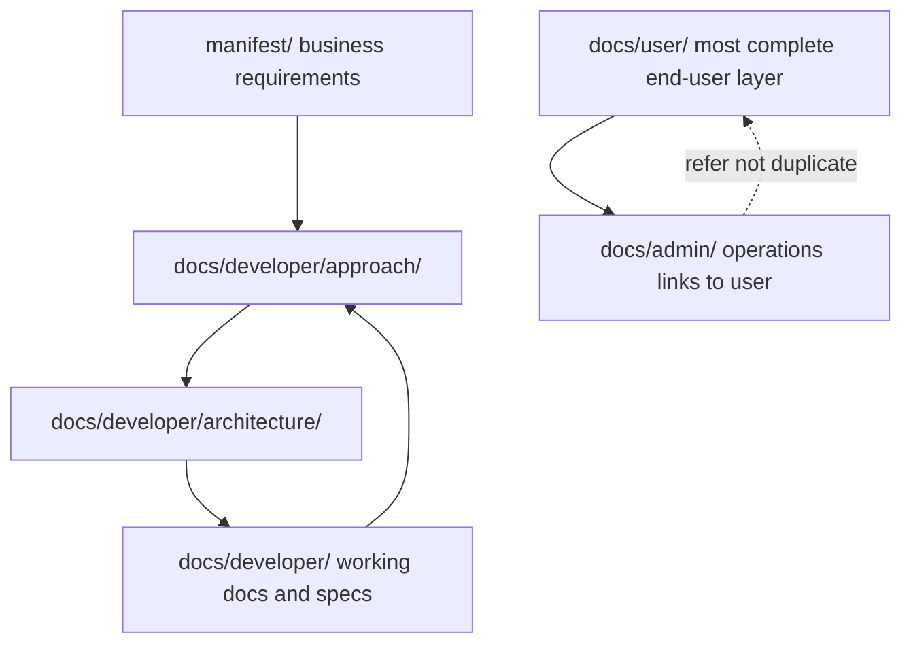

# Knowledge management

mka-bootstrap defines a **layered, discoverable documentation architecture** for software projects. Information flows from business intent (manifest) through approach and architecture to user-facing and admin documentation.

## Information layers

| Layer | Location | Content |
|-------|----------|---------|
| Manifest | `manifest/` | BRs, personas, glossary, roadmap processes, Deep Backlog |
| Approach | `docs/developer/approach/` | Workflow bridges; milestone lifecycle |
| Architecture | `docs/developer/architecture/` | Solution-independent strategy, taxonomy, standards |
| Time Capsule architecture | [time-capsule.md](time-capsule.md), [visual-style.md](visual-style.md) | System design and UI tokens for this solution |
| Developer working | `docs/developer/` top-level specs | In-progress specs; promote when stable |
| User | `docs/user/` | Complete end-user documentation; may be published/syndicated |
| Admin | `docs/admin/` | Operations; defer to user docs for shared topics |

## Branch model: main vs install

| Branch | Audience | Purpose |
|--------|----------|---------|
| `main` | Maintainers | Develop the template; live ROADMAP; releases |
| `install` | Consumers | Clone → `./install.sh` → new solution repo |

Publish cycle: sprint close-out on `main` → `release/vX.Y.Z.md` → `publish-to-install.sh` → push `install`.

## Dogfooding

mka-bootstrap **is** a governed project. Maintainers on `main` use the same ROADMAP, milestone workflow, skills, and release process that consumers inherit.

## Two-remote solution model

After consumer `./install.sh`:

| Remote | Points to | Purpose |
|--------|-----------|---------|
| `origin` | Solution repo | Day-to-day work |
| `project-bootstrap` | mka-bootstrap | Fetch template updates |

## Agent skills

Canonical skills: `docs/developer/skills/`. Platform folders (`.cursor/`, `.github/`, `.claude/`, `.agents/`) contain **routing stubs only**.

Stack-specific skills may be added later under `docs/developer/skills/` without changing the bootstrap layout.

## Working documents and promotion

Exploratory docs may live at `docs/developer/` top level during implementation. When stable, promote using [working-doc-promotion.md](../approach/working-doc-promotion.md).

## Offline test harness

Maintainers validate install/bootstrap locally via `.local-test/` (gitignored) with bare git remotes. See [local-test-harness.md](../approach/local-test-harness.md).
