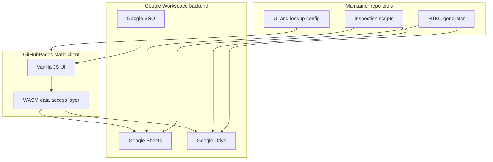

# Time Capsule — technical architecture

Solution-independent strategy for the Convention Time Capsule: a lessons-learned archive for the **30th AFL-CIO Convention**.

Business intent: [manifest/business-requirements.md](../../../manifest/business-requirements.md). Scoping source: [missives/2026-06-09-convention-time-capsule-stakeholder-scoping.md](../../../missives/2026-06-09-convention-time-capsule-stakeholder-scoping.md). MVP cuts: [mvp-scoping.md](../approach/mvp-scoping.md).

## Problem and scope

Conventions are years apart. Staff rotate; institutional memory fades. This system captures what worked, what did not, and hard-won suggestions across six knowledge domains into a single durable archive that improves as submissions accumulate.

**v1 scope:** One archive for the 30th convention. Multi-event reuse is a post-MVP theme (see [Deep-Backlog.md](../../../manifest/Deep-Backlog.md)).

## System context



| Layer | Role |
|-------|------|
| **GitHub Pages** | Host static HTML, CSS, vanilla JS, WASM binary — no application server |
| **WASM** | Abstract Google Sheets API and Drive API; token handoff from OAuth |
| **Google Sheets** | Structured submissions, lookups, classifications, roles |
| **Google Drive** | Document attachments and HTML export artifacts |
| **Repo tools** | Maintainer inspection, export generation, UI/taxonomy source updates |

## Storage schema

### Google Sheet tabs

| Tab | Purpose | Key columns (draft) |
|-----|---------|---------------------|
| **Submissions** | Core lesson records | `id`, `created_at`, `submitter_email`, `contact`, `domain`, `title`, `body`, `attachment_ids`, `status` |
| **Lookups** | Taxonomy and synonyms | `canonical`, `type` (domain/tag), `synonym`, `active` |
| **Classifications** | Team-lead enrichments | `submission_id`, `classified_by`, `tags`, `severity`, `area`, `follow_up_status`, `notes`, `cross_links` |
| **Roles** | Authorization (if Sheet-backed) | `email`, `role` (submitter, team_lead) |

Schema version is stamped in a **Meta** tab or header row (`schema_version`, `convention_id`: `30th`).

### Google Drive layout

```
Convention-Time-Capsule/
├── attachments/          # Per-submission uploads
└── exports/              # Generated HTML archives
```

Folder and Sheet IDs are non-secret configuration (see [google-workspace-bootstrap.md](../approach/google-workspace-bootstrap.md)).

## Auth model

GitHub Pages has **no server**. Authentication uses Google OAuth 2.0 in the browser:

1. User signs in with org Google account (Workspace domain restriction TBD — see [mvp-scoping.md](../approach/mvp-scoping.md)).
2. Client receives access token; WASM uses it for Sheets/Drive API calls.
3. Submitter identity is recorded on each submission.

**Team-lead elevation** (open decision):

- Sheet-backed **Roles** tab, or
- Google Group membership check, or
- Allowlist in configuration

Maintainer repo tools use **[gws](https://github.com/googleworkspace/cli)** (Google Workspace CLI) with a **Desktop** OAuth client — separate from the Web client used by the Pages app. Optional service account for headless CI via `GOOGLE_WORKSPACE_CLI_CREDENTIALS_FILE`.

## Maintainer toolkit

Repo-side operations use `gws` and [scripts/google/](../../../scripts/google/):

| Script | Milestone | Purpose |
|--------|-----------|---------|
| `check-gws.sh` | M-003 | Verify `gws` on PATH |
| `smoke-read-meta.sh` | M-003 | Read `Meta` tab; bootstrap verification |
| `inspect-archive.sh` | M-010 | Dump Submissions, Lookups, Classifications |

See [google-workspace-cli.md](../approach/google-workspace-cli.md). M-009 HTML export may pull Sheet data via `gws` before rendering the bundle.

The browser WASM layer and maintainer `gws` toolkit share the same Sheet/Drive backend but use different OAuth clients.

## WASM boundary

The WASM module owns:

- Sheets read/write (submissions, lookups, classifications)
- Drive upload and metadata
- Fixture mode for offline development (JSON fixtures instead of live API)

The vanilla JS UI owns:

- DOM rendering and form interaction
- OAuth redirect / token acquisition
- Calling WASM exports

Compile target and language TBD (Rust or similar). Toolchain is pinned in repo for reproducible builds (BR-008).

## Longevity constraints

| Constraint | Approach |
|------------|----------|
| Static hosting | GitHub Pages; no runtime server to maintain |
| Open formats | Documented Sheet schema; HTML as archival export |
| Minimal runtime deps | Vanilla JS + WASM only at runtime |
| Pinned artifacts | Versioned WASM/JS builds checked in or released per tag |
| Dormancy | HTML export readable without live app; fixture mode for revival |

## Knowledge domains

Fixed v1 set (lookup seed):

1. Technical systems and integrations
2. Logistical operations
3. Attendee satisfaction
4. Vendor collaboration
5. Staff morale
6. Health and safety

## Open decisions

Deferred to [mvp-scoping.md](../approach/mvp-scoping.md):

- Team-lead authorization model
- Attachment size limits and MIME allowlist
- Similarity search: live API vs domain/tag filter for MVP
- PII retention and redaction on export
- HTML bundle layout: single file vs `index.html` + assets folder

## Related documents

- [visual-style.md](visual-style.md) — UI tokens derived from AFL-CIO convention pages
- [submission-workflow.md](../approach/submission-workflow.md) — two-phase submit and enrich flow
- [google-workspace-bootstrap.md](../approach/google-workspace-bootstrap.md) — cloud project checklist
- [google-workspace-cli.md](../approach/google-workspace-cli.md) — maintainer `gws` toolkit
