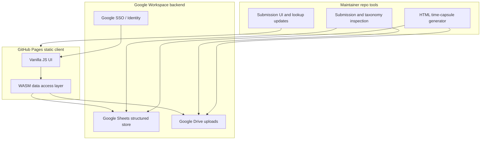

# 2026-06-09 — Convention Time Capsule — Stakeholder Scoping Brainstorm

**Stakeholders (draft):** convention production staff, team leads, future planning leads, DAIR/maintainers

**Scope:** Single archive for the **30th AFL-CIO Convention** (not multi-event reuse in v1).

**Vision:** Capture hard-won lessons across technical, logistical, attendee, vendor, morale, and safety domains so a future team — years later, with attrition and part-time staffing — can learn without repeating mistakes.

---

## Problem statement

Conventions happen years apart. Plenty of time passes for attrition and lapses in memory. Convention production is staffed by personnel who have other jobs and may lack direct experience with a convention production cycle.

Lessons from one cycle rarely survive intact to the next. What worked, what did not, suggestions, and wisdom hard-won across domains are scattered — in email threads, individual memory, and ad-hoc notes — and are not available when someone is trying to capture or find relevant feedback.

We need a **time capsule** to our future selves: a durable, searchable archive that gets better as input is collected, normalizing and enhancing look-up values, detecting patterns, and giving visibility into prior submissions as part of the submission process itself.

---

## Personas (draft)

Seeds for later promotion to [manifest/personas.md](../manifest/personas.md).

| Persona | Goal |
|---------|------|
| **Submitter** | Low-friction capture while memory is fresh; enough contact information for follow-up |
| **Team lead** | Classify, enrich, and organize submissions into a coherent archive |
| **Future reader** | Discover relevant prior lessons before or during the next planning cycle |
| **Maintainer** | Examine cloud-backed data from this repo; evolve submission UI and taxonomy |

---

## Knowledge domains (in scope)

- Technical systems and integrations
- Logistical operations
- Attendee satisfaction
- Vendor collaboration
- Staff morale
- Health and safety

---

## Functional requirements (BR seeds)

Draft acceptance-oriented intent — not yet numbered BR-###.

### Submission (active mode)

- **Google SSO** (org standard); identify submitter for follow-up.
- Structured fields plus free text; optional **document upload** (general facility, not per-domain).
- **During submission:** surface similar prior submissions; suggest normalized categories and tags from growing lookup tables.
- Minimize required fields; optimize for speed on mobile and desktop.

### Post-submission (team-lead mode)

- Team leads classify feedback **after** it is submitted (classification does not block initial submit).
- Enrich entries: tags, severity, area, follow-up status, cross-links.
- Organize the corpus into a browsable archive.

### Learning loop

- The solution improves as the corpus grows: normalize lookup values, detect recurring patterns, expose trends to submitters and leads.
- Prior submissions are visible **as part of** the submission flow — not only in separate admin views.

### Time-capsule generation

- Export a **self-contained HTML** archive (primary future-proof format).
- HTML bundle opens offline, embeds or links attachment metadata, and remains readable without the live app.
- Include generation timestamp, schema/version stamp, and convention identifier (30th).

### Maintainer / repo mode

- Facility in **this repo** to inspect cloud-backed submissions and taxonomy.
- Use inspection to update submission UI fields, lookups, and copy — without requiring a live app redeploy for every content tweak where possible.

---

## Non-functional requirements

- **Longevity:** Must work sensibly after years of disuse — favor static hosting, open formats, pinned build artifacts, minimal runtime dependencies.
- **Simplicity:** Limit JavaScript libraries; a WASM data-access layer drives the front end.
- **Low friction:** Submission in minutes, not a form marathon.
- **Security and privacy:** Org Google accounts; sensible handling of uploads and PII in follow-up fields.

---

## Technical strategy

Architecture sketch for a later spec in [docs/developer/architecture/](../docs/developer/architecture/).

### Deployment

GitHub Pages serves static assets: HTML, CSS, minimal JavaScript, and a WASM binary.

### Storage model (proposed Sheets + Drive layout)

| Artifact | Store | Purpose |
|----------|-------|---------|
| Submissions | Sheet | Core rows: id, timestamps, submitter, contact, domain, body, attachment refs, status |
| Lookups / taxonomy | Sheet | Categories, tags, synonyms, normalized values |
| Classifications | Sheet | Team-lead enrichments linked to submission id |
| Attachments | Drive folder | General document upload facility |
| Time-capsule export | Drive + repo artifact | Generated standalone HTML bundle |

### WASM data-access layer

- Single abstraction over Google Sheets API and Drive API (and auth token handoff).
- Keeps the UI thin; enables local/offline testing in the repo with fixture data.
- Compile target and language TBD in architecture spec (Rust or similar); pin toolchain in repo for reproducibility.

### Auth note

GitHub Pages has no server. OAuth uses a public Google client id; token handling and role checks (submitter vs team lead) need explicit design — likely Sheet-backed roles or Google Group membership.

### Minimal JavaScript policy

Runtime = vanilla JavaScript + WASM. Build-time tooling only; no heavy SPA framework.

---

## Operating modes

| Mode | Where | Who |
|------|-------|-----|
| Active submission | GitHub Pages app | Submitters (Google SSO) |
| Classification / enrichment | Same app, elevated role | Team leads |
| Cloud inspection | Repo scripts or local tools | Maintainers |
| UI / taxonomy evolution | Repo source | Maintainers |
| Time-capsule generation | Repo tool → HTML artifact | Maintainers / leads |

---

## Open questions (deferred)

- Team-lead authorization model (Sheet column vs Google Group vs allowlist).
- Attachment size limits and allowed MIME types.
- Whether submission similarity search is live API or periodic snapshot synced to repo.
- Retention and redaction policy for PII in follow-up fields.
- Exact HTML bundle layout (single file vs folder with `index.html` + assets).

---

## Proposed epic themes

For later promotion to [manifest/Deep-Backlog.md](../manifest/Deep-Backlog.md).

- **E-001** Google SSO + Sheets/Drive connectivity (WASM layer)
- **E-002** Low-friction submission UI with prior-submission surfacing
- **E-003** Lookup normalization and pattern visibility
- **E-004** Team-lead classification and enrichment
- **E-005** Document upload facility
- **E-006** Maintainer cloud inspection tooling
- **E-007** HTML time-capsule generator
- **E-008** Longevity and dormancy hardening (pinned builds, schema versioning, offline HTML)

---

## Success criteria (draft)

- A convention staffer can submit meaningful feedback in under five minutes with Google SSO.
- Submitters see relevant prior entries while composing.
- Team leads can classify and enrich without re-opening the original submitter flow.
- Maintainer can inspect cloud data from the repo and ship UI/taxonomy updates.
- Generated HTML archive is readable offline years later without the live app.

---

## Cross-links and follow-on work

- Product framing: [README.md](../README.md) (30th AFL-CIO Convention)
- BR-###, personas, architecture spec, and ROADMAP milestones are **out of scope for this missive** — promote in a follow-on scoping milestone.

| Artifact | When |
|----------|------|
| [manifest/business-requirements.md](../manifest/business-requirements.md) BR-### | Next scoping milestone |
| [manifest/personas.md](../manifest/personas.md) | Promote draft personas from this missive |
| `docs/developer/architecture/time-capsule.md` | Stable architecture spec |
| [ROADMAP.md](../ROADMAP.md) M-### milestones | After BR acceptance |
| Application code / WASM / Pages workflow | Implementation milestones |
